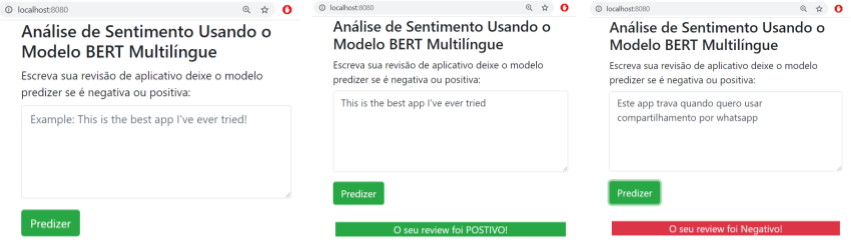

# Projeto multi-language-sentiment-analysis

Este projeto tem como objetivos:
- Capturar de avaliações de aplicativos do Google Play Store via webscrapping com Selenium e google-play-scrapper ([Script](../master/data/app_scrapping.py)).
- Utilizar o modelo BERT para representação de sentenças e construir um classificador multilingue para análise de sentimentos: revisões positivas e negativas de aplicativos ([Notebook Jupyter](../master/model/exploring_bert.ipynb)).
- Construir uma API em Flask que permite classificar sentenças e uma página web simples que usa essa API via requisição assíncrona com Javascript/JQuery.

## Demonstração



## Instalação

Clonar o repositório do GitHub.
```bash
$ git clone https://github.com/anfer86/multi-language-sentiment-analysis.git
$ cd multi-language-sentiment-analysis
```

Criar um Virtual Environment para a aplicação. Isto vai criar uma pasta dentro do projeto para colocar as bibliotecas necessárias para rodar a aplicação.
```bash
$ python -m venv env
```

Ativar o Virtual Environment no Windows
```bash
$ env\Scripts\activate.bat
```

Ativar o Virtual Environment no Linux
```bash
$ source env\bin\activate
```

Instalar as dependências presentes no arquivo `requirements.txt`
```bash
$ pip install -r requirements.txt
```

Ao instalar no sistema operacional Linux é necessário remover `pywin32` das dependências do projeto.

## Utilização

Diferentes formas de inicializar a aplicação para Windows e Linux:

- No Windows: executando o arquivo `run.py`
```bash
$ python run.py
```

- No Windows: usando o WSGI waitress-serve (instalar dependência separadamente)
```bash
$ waitress-serve --listen=localhost:8080 app:app
```

- No Linux: executando o arquivo `run.py`
```bash
$ python run.py
```

- No Linux: usando o WSGI gunicorn (disponível no `requirements.txt`, instalado na etapa anterior)
```bash
$ gunicorn app:server
```

Depois de inicializar a aplicação de qualquer uma das formas acessar http://localhost:8080 e testar a aplicação com avaliações de aplicativos em portugês, inglês, e em outros idiomas.

# Autor
* **Carlos Andres Ferrero** - [anfer86](https://github.com/anfer86/)